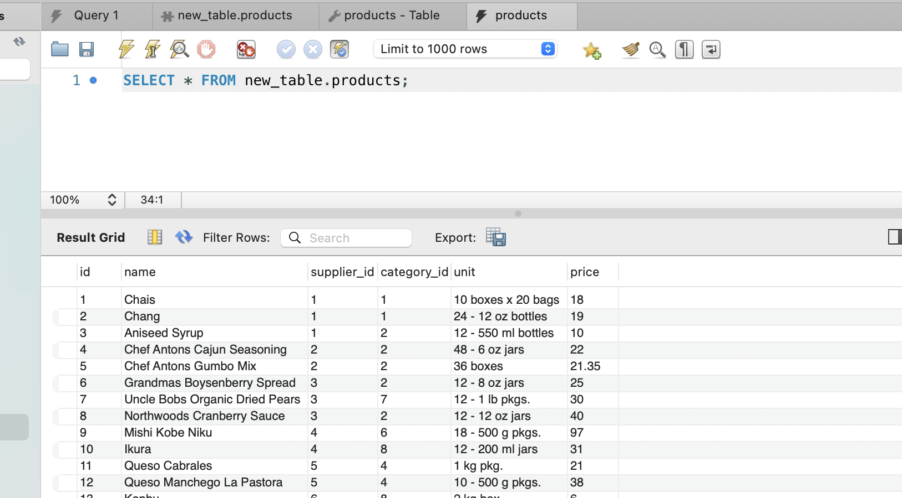
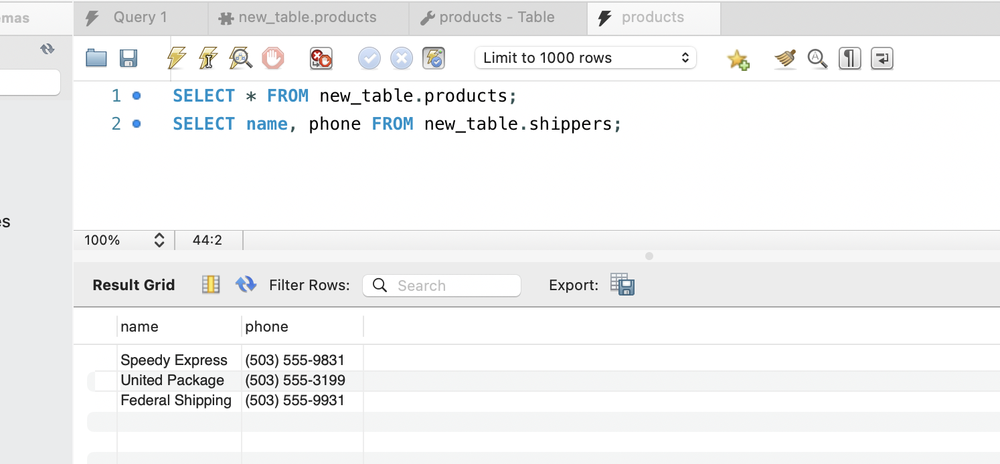
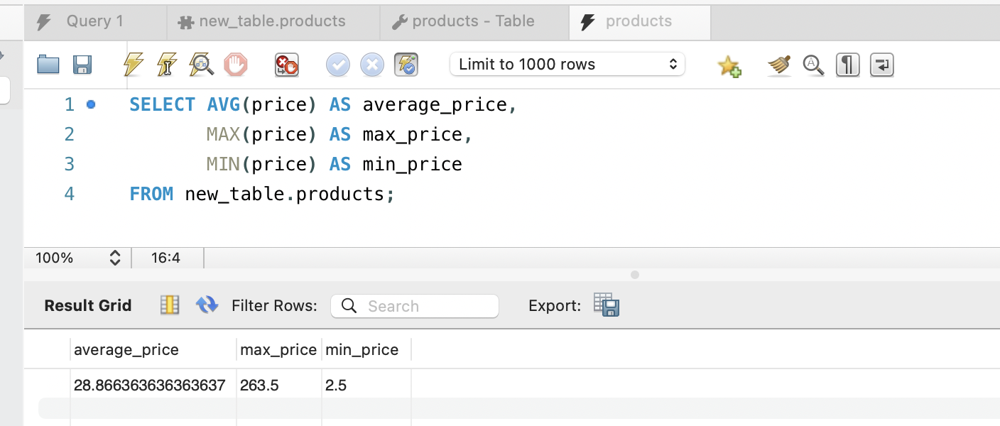
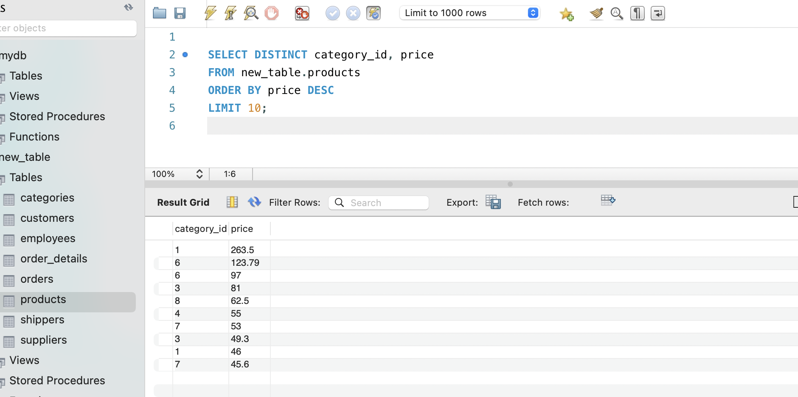
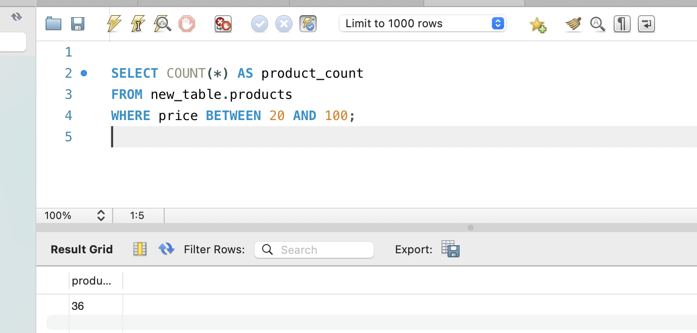
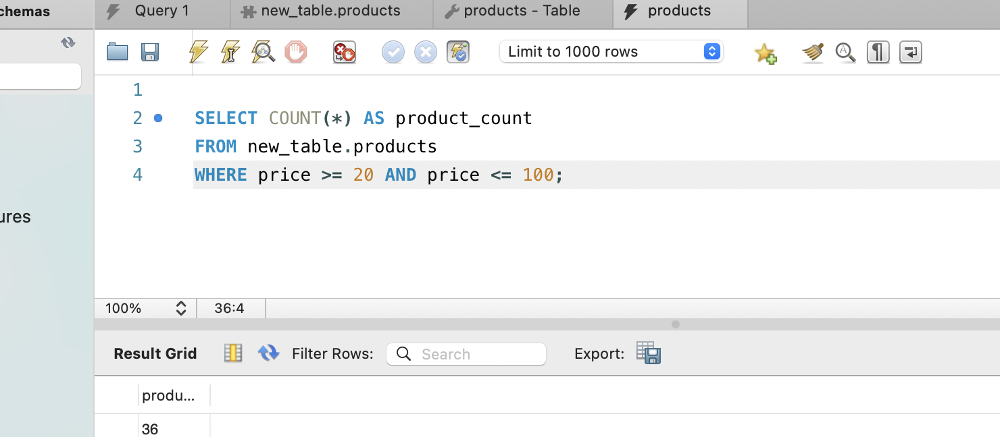
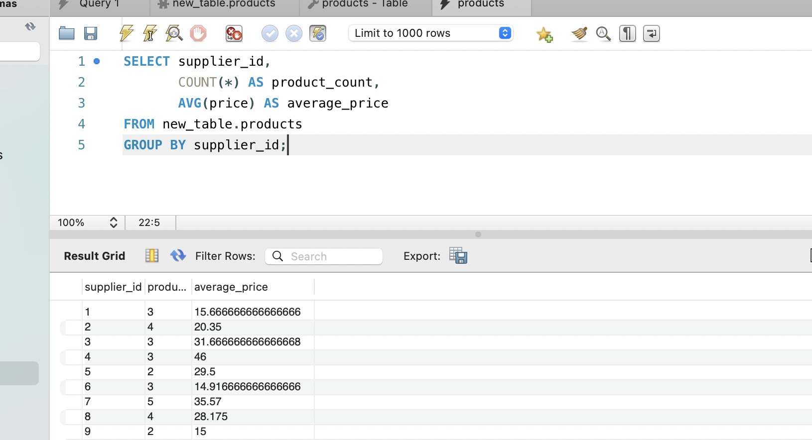

1. Напишіть SQL команду, за допомогою якої можна:

вибрати всі стовпчики (За допомогою wildcard “*”) з таблиці products;
вибрати тільки стовпчики name, phone з таблиці shippers.

**Рішення**

SELECT * FROM new_table.products;
SELECT name, phone FROM new_table.shippers;

2.  Напишіть SQL команду, за допомогою якої можна знайти середнє, максимальне та мінімальне значення стовпчика price таблички products

**Рішення** 

SELECT AVG(price) AS average_price, 
       MAX(price) AS max_price, 
       MIN(price) AS min_price
FROM new_table.products;

3. Напишіть SQL команду, за допомогою якої можна обрати унікальні значення колонок category_id та price таблиці products.

Оберіть порядок виведення на екран за спаданням значення price та виберіть тільки 10 рядків
 
**Рішення** 

SELECT DISTINCT category_id, price 
FROM new_table.products
ORDER BY price DESC
LIMIT 10;

4. Напишіть SQL команду, за допомогою якої можна знайти кількість продуктів (рядків), які знаходиться в цінових межах від 20 до 100

**Рішення** 

SELECT COUNT(*) AS product_count
FROM new_table.products
WHERE price BETWEEN 20 AND 100;

SELECT COUNT(*) AS product_count
FROM new_table.products
WHERE price >= 20 AND price <= 100;

5. Напишіть SQL команду, за допомогою якої можна знайти кількість продуктів (рядків) та середню ціну (price) у кожного постачальника (supplier_id)

SELECT supplier_id, 
       COUNT(*) AS product_count, 
       AVG(price) AS average_price
FROM new_table.products
GROUP BY supplier_id;

